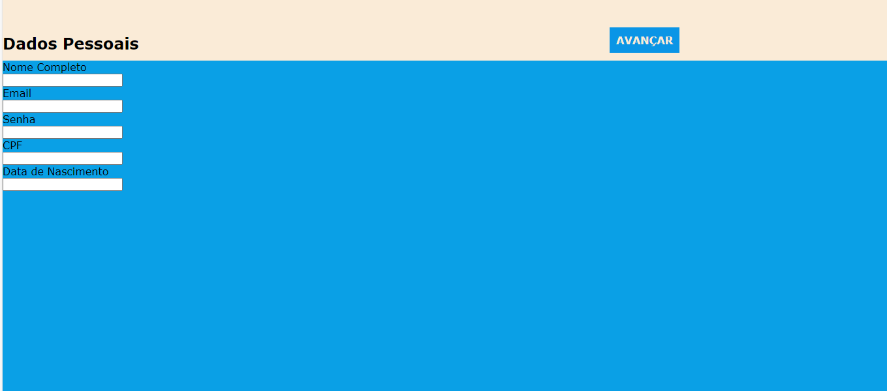

# FORM-ECOMERCE

Esse projeto conciste na criação de formulario decontato.
## índice
* [descrição](#descrição)
* [Tecnologias](#tecnologias)
* [Referências](referências)
* [Autor(a)](#autora)

## Descrição

Nesse projeto foi riado uma página de formulario de contato

## começo do projeto 



## meio do projeto


## parte final do projeto


## propriedades ultilizadas 

* heigth - determina altura da área do conteúdo de um elemento.

* background-color - ultilizado para colocar cor no projeto.

* font-family -  ultilizado para escolher fonte das letras.

* width -  determina a largura da área do conteúdo d um elemento. A área de conteúdo fica dentro do preenchimento, da borda, e da marem de um elemento.

* border-radius - deixa as bordas do container aredondadas.

* box-shadow - adiciona efeitos de sombra ao redor do quadro do elemento.

* border - define a borda de elemento.

* font-weight - define o peso (ou negrito) da fonte.

* color - para definir a cor do texto.

## elementos html ultilizados

* main - represena o conteúdo dominante do <corpo> de um documento.

* form - representa uma seção de docuento que contém controles interativos para enviar informações.

* label - representa uma legenda para um item em uma interface do usuário.

* input - usado para criar controles interativos para formulários baseados na Web para aceitar dados do usuário; Uma ampla variedade de tipos de dados de entrada e widgets de controle estão disponíveis, dependendo do dispositivo e do agente do usuário.

* textarea - representa um controle de edição de texto sem formatação de várias linhas, útil quando você deseja permitir que os usuários insiram uma quantidade considerável de texto de formato livre, por exemplo, um comentário em um formulário de revisão ou feedback.

* button - é um elemento interativo ativado por um usuário com um mouse, teclado, dedo, comando de voz ou outra tecnologia assistiva.

## Estilização 

* O projeto foi estilizado ultilizando o arquivo de login.css.

```

*{
    margin: 0;
    padding: 0;
    font-family: Verdana, Geneva, Tahoma, sans-serif;
}
 
nav#menu ul{
    text-transform: uppercase;
    list-style: none;
    position: absolute;
    top: 60px;
    left: 930px;
}
 
 
.foto{
    text-align: center;
}
nav#menu{
    display: block;
}
 
nav#menu li{
    display: inline-block;
    background-color: rgb(10, 149, 230);
    padding: 10px;
 
}
body{
    background: rgb(10, 160, 230);
   
}
header{
    background-color: antiquewhite;
    padding-top: 70px;
    padding-bottom: 12px;
    position: relative;
}
 
/*Pseudoclasses para estilização de menu de navegação*/
nav#menu a:link{
    text-decoration: none;
    color: antiquewhite;
    font-weight: bold;
}
nav#menu a:visited{
    text-decoration: none;                                                  
    color: antiquewhite;
    font-weight: bold;
}
nav#menu a:hover{
    color: rgb(255, 255, 255);  
}
nav#menu li:hover{
    background-color: rgb(16, 5, 19);
   
}
h2{
    font: size 70px;
}
#frase{
    width: 100%;
    align-content: center;
    text-align: center;
}

```

## Tecnologias 

* HTML5
* CSS3
* GIT
* Github
* README

## Referências
[Mozilla](https://developer.mozilla.org/en-US/docs/Web/CSS/justify-content)

## Autor(a)
O projeto foi desenvolvido por: 

* Rafaela Yasmin Araujo De Souza.